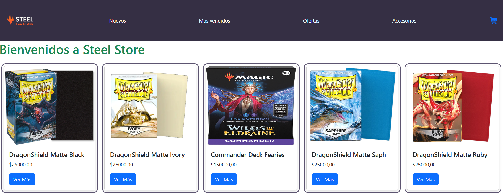

# Steel Store App 🛒 ☀️💧🔥🥬💀

Este proyecto fue diseñado para enseñar las bases de React
Utilicé como temática una tienda de productos relacionados a Magic The Gathering

### Instalación 🔧⚙️

- Requisito técnico: Contar con Node v20 o superior instalado en la PC. \*

1. Clone el repositorio
2. Hacer el comando `cd warriors-react-proyect` para moverse a la carpeta raiz del proyecto.
3. Instalar dependencias con el comando `npm install`.
4. Para levantar el proyecto de manera local ejecute el comando `npm run dev`

### Librerias 📒📘📕📗📓

Las librerias que utilicé en este proyecto fueron:

[Firebase](https://firebase.google.com/): Utilizado como base de datos.
[React Router Dom](https://reactrouter.com/home): Utilizado para la navegación por rutas.
[React Bootstrap](https://react-bootstrap.netlify.app/docs/getting-started/introduction): Utilazado para el styling del proyecto.
[React Icons](https://react-icons.github.io/react-icons/): Utilizado para los íconos del proyecto.

### Funcionalidad 🚀

El proyecto es una tienda de productos relacionados al TCG (Trading Card Game) conocido como
Magic The Gathering.
En la misma podrás realizar compras de mazos preconstruidos del formato Commander y Accesorios para las cartas.
Se puede también adicionar diferentes cantidades de productos así como también eliminarlos.
Una vez realizada la compra, debemos llenar un formulario que nos genera una orden de compra con un comprobante y a nombre de quién está el pedido realizado.

### Comentarios

Como soy un gran fanático del juego opté por cumplir el sueño de muchas tiendas de Arg. que es tener
su propia página.
La verdad disfruté mucho realizando esta app así como también de las clases recibidas.
Muchas gracias por este gran curso, por la paciencia y disposición.
